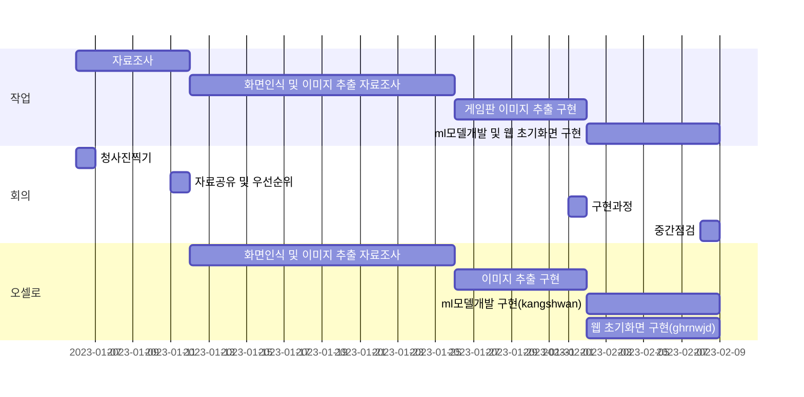

# MINIGAME Story

OKR
|objective|메이플 미니게임 통합인공지능 구축(미니게임스토리)|
|------|------|
|key results1|3월 31일전 마감(minimum 다음 여름방학이벤트 전까지)|
|key results2|게임승률 90%|
|key results3|모든미니게임에 대해 지원가능|
gantt chart

```mermaid
gantt
    dateFormat  YYYY-MM-DD
    section 작업
    자료조사 : a1, 2023-01-06, 6d
    화면인식 및 이미지 추출 자료조사 : a2, after a1, 14d
    게임판 이미지 추출 구현 : a3, after a2, 7d
    ml모델개발 및 웹 초기화면 구현:a4, after a3, 7d
    
    section 회의
    청사진찍기 :2023-01-06, 1d
    자료공유 및 우선순위 : 2023-01-11,  1d
    구현과정 : 2023-02-01, 1d
    중간점검 : 2023-02-08, 1d
    
    section 오셀로
    화면인식 및 이미지 추출 자료조사 :  after a1, 14d
    이미지 추출 구현 : after a2, 7d
    ml모델개발 구현(kangshwan): b1, after a3, 7d
    웹 초기화면 구현(ghrnwjd): c1, after a3, 7d

```
